# Подключаем WhatsApp через Систему взаимодействия  

Подключите WhatsApp к своей базе 1С всего за 5 минут. Никаких доработок кода не требуется. Все работает сразу "из коробки". Вы сможете вести переписку WhatsApp со своими клиентами прямо из программы 1С. Это удобно и функционально.  

[Скачать](https://github.com/green-api/whatsapp-api-client-1c-cs/releases/download/release/GreenAPI.cfe) файл интеграции от GREEN-API.

Для отправки и получения сообщений WhatsApp достаточно настроить подключение с «Системой взаимодействия», добавить расширение и можно сразу приступать к работе.

- Никаких изменений конфигурации не требуется.
- Никаких веб-серверов и внешних незащищенных IP-адресов.
- Всё работает сразу "из коробки".

Обработка тестировалась на версии платформы **8.3.20.1549**

Потребуется создать учетную запись в сервисе **GREEN-API**  

## Содержание

* [Возможности](#Возможности)  
* [Настройка подключения системы взаимодействия](#Настройка-подключения-системы-взаимодействия)  
* [Подключение расширения](#Подключение-расширения)  
* [Создание учетной записи в сервисе GREEN-API](#Создание-учетной-записи-в-сервисе-GREEN-API)  
* [Добавление пользователей WhatsApp](#Добавление-пользователей-WhatsApp)  
* [Добавление контактов](#Добавление-контактов)  
* [Создание беседы](#Создание-беседы)  
* [Отправка и получение сообщений для неконтекстного обсуждения](#Отправка-и-получение-сообщений-для-неконтекстного-обсуждения) 
* [Отправка и получение сообщений для контекстного обсуждения](#Отправка-и-получение-сообщений-для-контекстного-обсуждения) 
* [Вложения](#Вложения) 

## Возможности  

- Отправка и получение текстовых сообщений
- Отправка и получение документов
- Отправка и получение фото и видео
- Отправка и получение аудиофайлов
- Получение голосовых сообщений
- Контекстные обсуждения
- Неконтекстные обсуждения

## Настройка подключения системы взаимодействия  
Подключить «Систему взаимодействия» можно на любой, даже пустой, конфигурации, начиная с платформы «8.3.10» и выше. В конфигурации обязательно должен быть хотя бы один пользователь, и он должен обладать правом «Регистрация системы взаимодействия»:

  

Если планируется использовать сервис фирмы 1С, то на рабочих местах не должно быть запрета на адрес «wss://1cdialog.com:443».

Когда все условия в информационной базе соблюдены, можно начинать использовать «Систему взаимодействия». Для этого необходимо её сначала подключить к сервису «1С: Диалог». Управление подключением к «Системе взаимодействия» производится в пользовательском режиме «1С:Предприятие» при помощи соответствующей стандартной функции, доступной через главное меню программы в разделе **«Функции для технического специалиста»**.

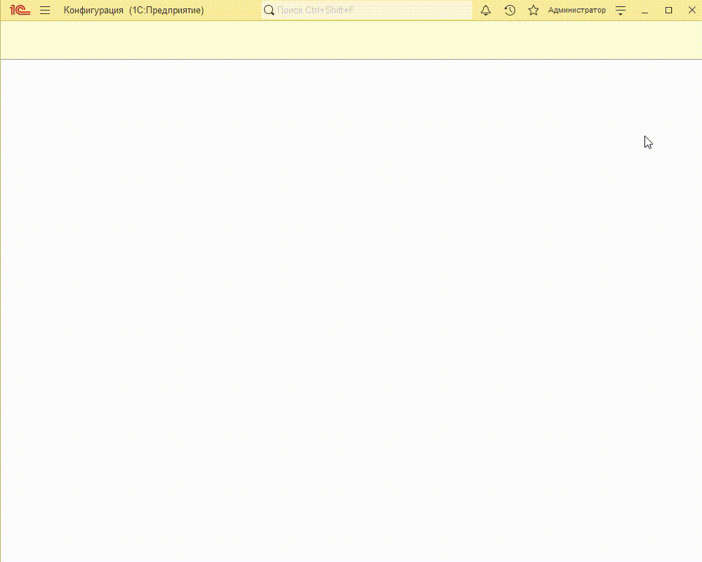

## Подключение расширения  

В данной статье не будет подробно рассматриваться процесс настройки подключения расширения в 1С, так как подробные инструкции можно легко найти в официальной документации и [многочисленных онлайн-руководствах](https://infostart.ru/1c/articles/1270436/). Вместо этого, будет предоставлена краткая анимация, демонстрирующая основные шаги настройки. После подключения расширения должна будет появиться подсистема **«GREEN-API»**.

{width="500"}  

## Создание учетной записи в сервисе GREEN-API  

Чтобы создать новую учетную запись, необходимо выполнить следующий действия:

- Перейти на сайт **GREEN-API** и зарегистрироваться в личном кабинете
- Создать инстанс на бесплатном тарифе **"Разработчик"**
- Скопировать значения «ID Instance» и «API Token» - далее эти значения понадобятся при настройке расширения

## Добавление пользователей WhatsApp  

Пользователи WhatsApp — это учетные записи в личном кабинете сервиса GREEN-API. Эти учетные записи используются для отправки и получения сообщений WhatsApp.

Для начала работы перейдите в сервис **GREEN-API**, создайте учетную запись и далее создайте инстанс на бесплатном тарифе "Разработчик". Функций бесплатного тарифа будет достаточно для проверки работы интеграции с WhatsApp.

Чтобы добавить пользователя WhatsApp, необходимо выполнить следующие действия:

- Из подсистемы «Green API» перейти к справочнику «Пользователи WhatsApp»
- Нажать на кнопку «Создать»
- В открывшемся окне заполнить реквизиты: «ФИО», «ID Instance» и «API Token» - эти параметры требуется скопировать из личного кабинета **GREEN-API**
- Нажать на кнопку «Записать и закрыть»

Кнопка **Открыть личный кабинет** — позволяет перейти в личный кабинет на сайте «Green API», где находятся инстансы подключения.

Кнопка **Проверить подключение** — позволяет проверить, правильно ли был настроен пользователь WhatsApp. 

Страница «Помощь» содержит изображение, на котором показано, откуда брать информацию для заполнения реквизитов справочника «Пользователи WhatsApp»:

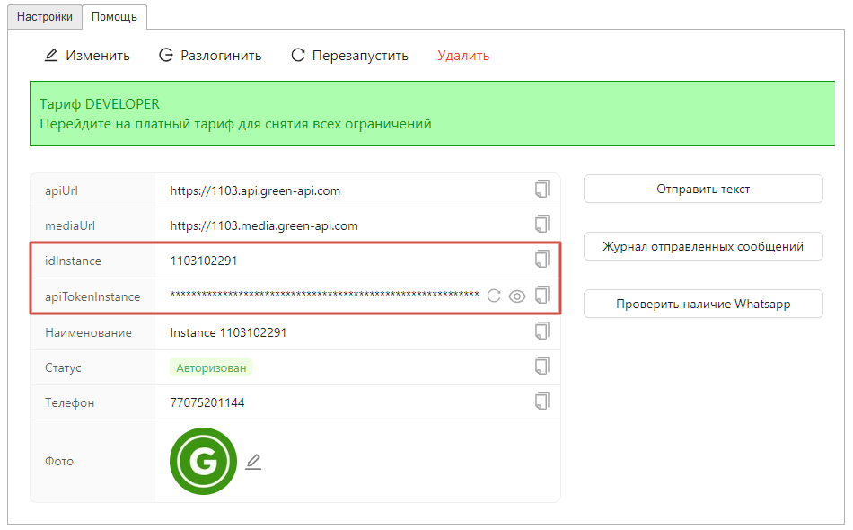

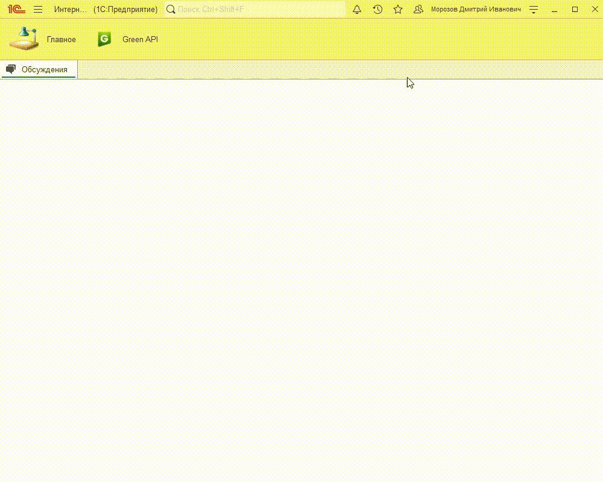
*Пример добавления пользователя WhatsApp*

## Добавление контактов  

Контакты из этого справочника будут получать сообщения. Чтобы добавить новый контакт, необходимо выполнить следующие действия:

- Из подсистемы «Green API» перейти к справочнику «Контакты»
- Нажать на кнопку «Создать»
- В открывшемся окне заполнить реквизиты: «Пользователь WhatsApp», «ФИО» и «Номер телефона»
- Нажать на кнопку «Записать и закрыть»

Кнопка **Подобрать контакты из WhatsApp** — позволяет загрузить контакты из WhatsApp.

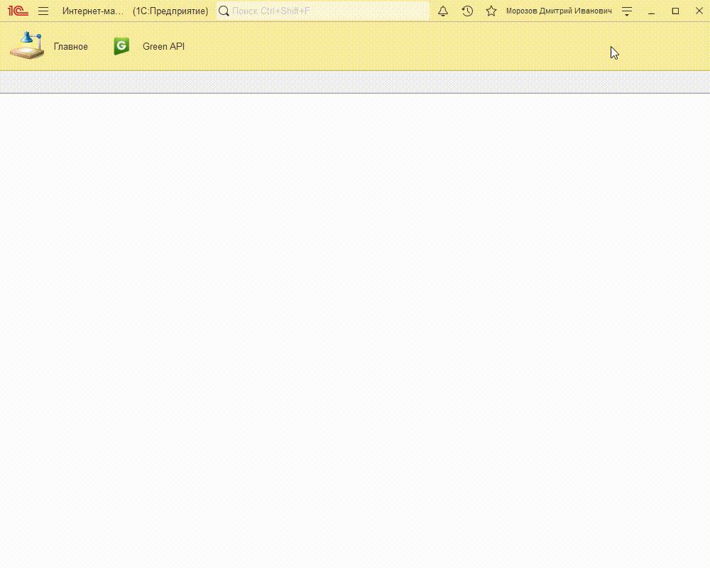
*Пример добавления контакта*

## Создание беседы  

Переписка с контактом будет выполняться в обсуждении системы взаимодействия. Чтобы начать новую беседу, необходимо выполнить следующие действия:

- Из подсистемы «Green API» перейти к справочнику «Контакты»
- Открыть контакт, для которого требуется создать новую беседу
- В открывшемся окне нажать на кнопку **Начать беседу**
- На странице «Обсуждения» появится новая беседа

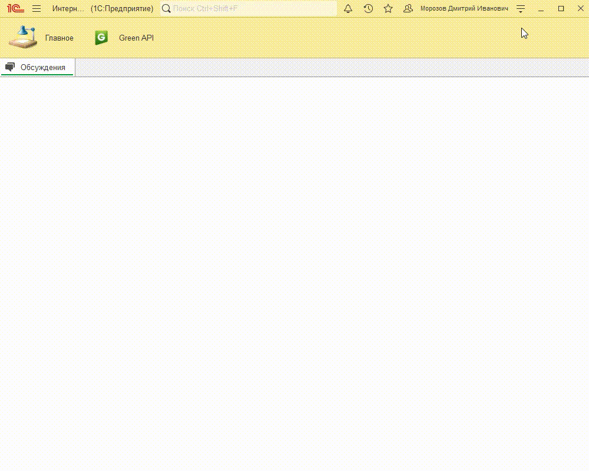 
*Пример создания беседы*

## Отправка и получение сообщений для неконтекстного обсуждения  

Неконтекстные обсуждения представляют собой чаты общего характера, доступные только тем пользователям, которые были добавлены в беседу.

Получение новых входящих сообщений выполняется автоматически, и никаких дополнительных действий не требуется. Кроме того, сообщения, полученные или написанные на других устройствах, автоматически синхронизируются при запуске решения 1С. 

Чтобы отправить сообщение в **WhatsApp**, необходимо выполнить следующие действия:

- Перейти на страницу «Обсуждения»
- Выбрать беседу с именем контакта
- Ввести текст сообщения
- Прикрепить файл, если требуется
- Нажать клавишу «Enter» для отправки,

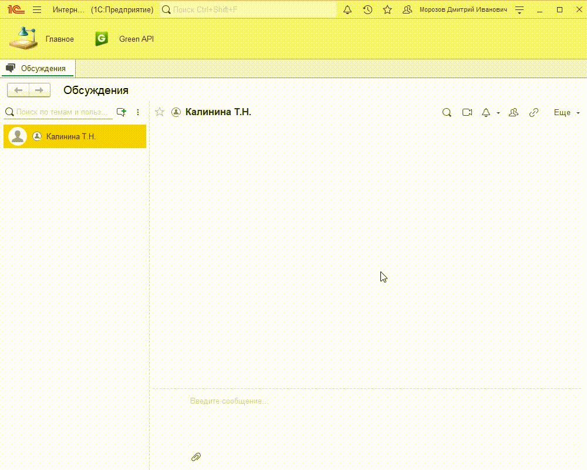
*Пример диалога с текстовым ответом*

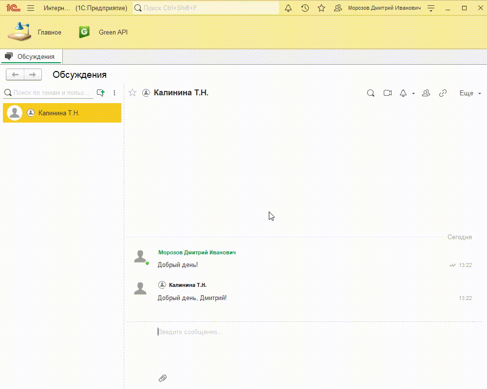
*Пример диалога с голосовым ответом*  

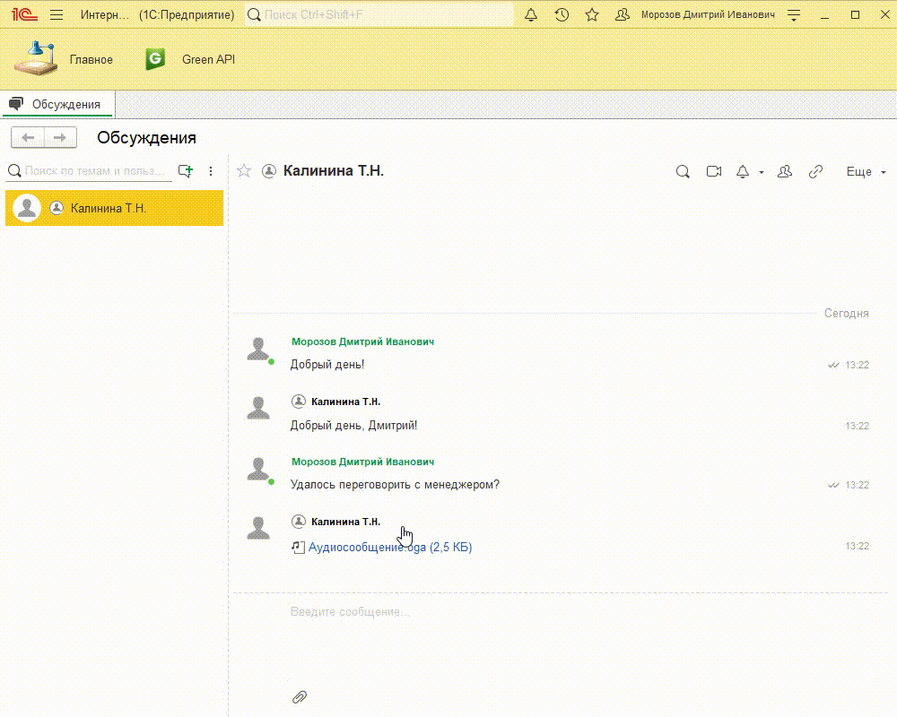{width="500"}
*Пример диалога с мультимедиа ответом*  

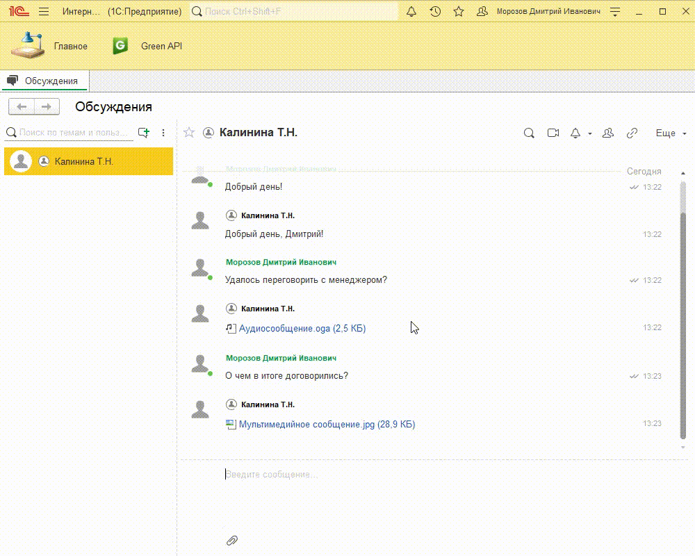
*Пример диалога с отправкой документа* 

## Отправка и получение сообщений для контекстного обсуждения  
Контекстные обсуждения используются в привязке к некоторым объектам информационной базы, что позволяет пользователям вести беседу по конкретному предмету, который в момент переписки будет находиться перед глазами.

Получение новых входящих сообщений выполняется автоматически, но по объективным причинам попадают в **неконтекстное обсуждение**. Полученные или написанные сообщения на других устройствах также автоматически синхронизируются при запуске решения 1С, но тоже попадают в **неконтекстное обсуждение**. Это важно учитывать при работе.

Чтобы отправить сообщение в **WhatsApp**, необходимо выполнить следующие действия:

- Перейти в любой документ
- Открыть **Обсуждение**
- Указать контакт пользователя, для которого требуется отправить сообщение
- Ввести текст сообщения
- Прикрепить файл, если требуется
- Нажать клавишу «Enter» для отправки

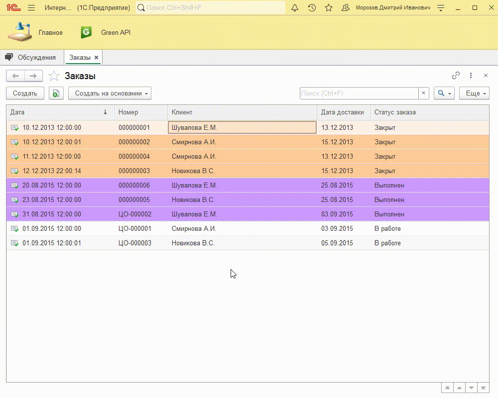
*Пример диалога для контекстного обсуждения*

## Вложения  

Любые аудио, фото, видео, ответы пользователя или документы автоматически помещаются во вложения системы взаимодействия. Каких-то дополнительных действий для их открытия не требуется, достаточно просто нажать на них левой кнопкой мыши. Исходя из типа файла, 1С либо сама откроет файл вложения, либо попросит выбрать программу, установленную на компьютер пользователя, с помощью которой этот файл можно будет открыть.

Чтобы открыть вложение, необходимо выполнить следующие действия: 

- Перейти на страницу «Обсуждения»
- Выбрать беседу с именем контакта
- Перейти к сообщению
- Нажать левой кнопкой мыши на гиперссылку сообщения

{width="500"}
*Пример просмотра аудиосообщения*

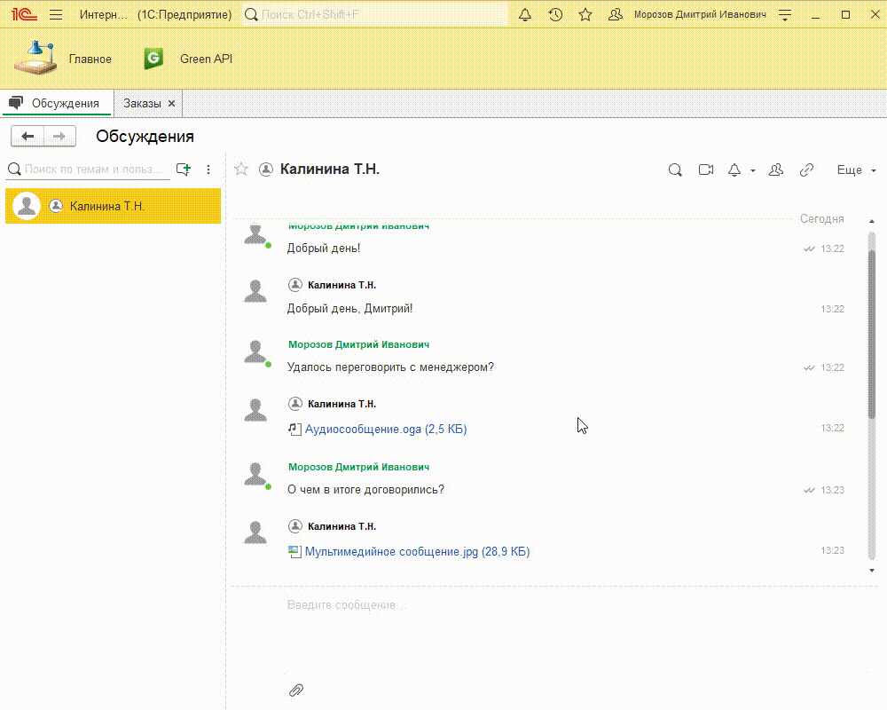{width="500"}
*Пример просмотра фотосообщения*

Проверено на следующих конфигурациях и релизах:

- Управление нашей фирмой, редакция 1.6, релизы 1.6.27.295

